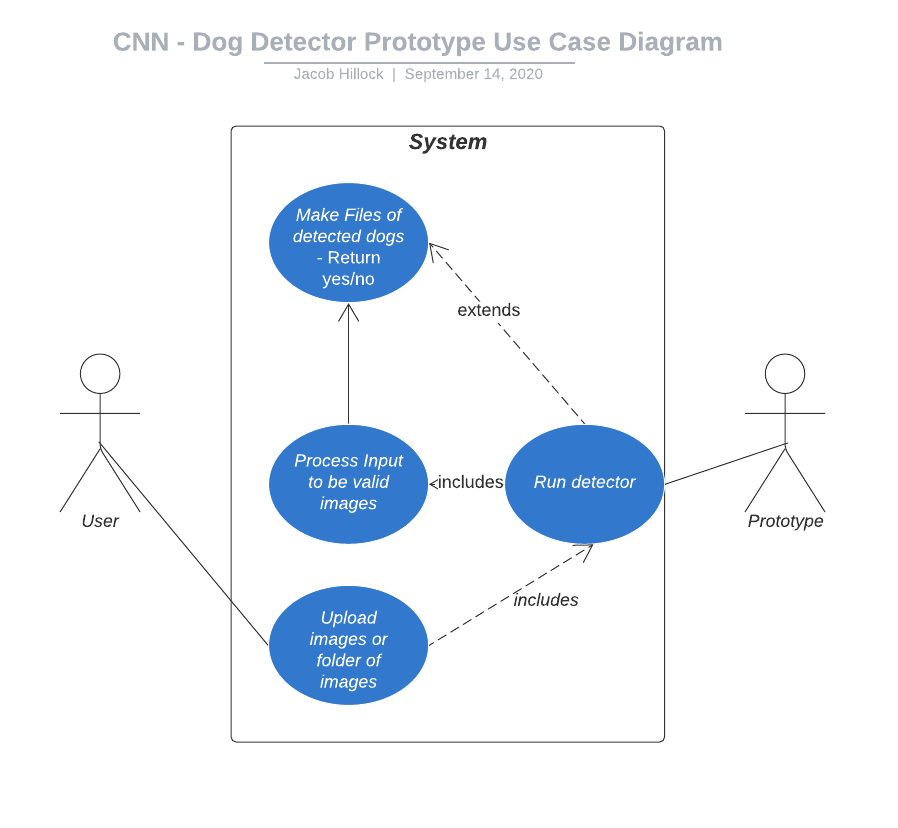

# Dog Breed Detector v0.1.0
This is an open source dog breed detector.

# CNN App Quick Access: 

On your Android Device, please click [here](https://github.com/COSC481W-2020Fall/cosc481w-581-2020-fall-convoluted-classifiers/blob/App-Installation-Documentation/App%20APK/app-debug.apk) to download the file: app-debug.apk

Once the app-debug.apk file is downloaded you will be prompted to install and open the application.

** Note: You will need to enable the ability to install APK's from "unknown sources" (Typically found in Settings > Applications > "Unknown Sources" checkbox) or you may be asked while downloading the application.

# How to install Android Studio:

Download Android Studio
https://developer.android.com/studio

Run the Android Studio Setup:

Under “Choose Components”, leave as default and continue
Choose the install location on your computer and continue
Under “Choose Start Menu Folder”, leave as default and continue
Wait for installation to complete and click Next
Launch Android Studio
When prompted to import Android Studio Settings select “Do not import settings”

Now we will go through the Setup Wizard:

Select “Standard” for the Install Type and Click Next
Select the “UI Theme” with your preference and Click Next
Click Finish

How to load the CNN Project from Github:

Open Android Studio
Choose “Project From Version Control”
Enter the Repository URL
https://github.com/COSC481W-2020Fall/cosc481w-581-2020-fall-convoluted-classifiers.git
Click Clone
It will ask if you want to open the project, Click Yes
It will take a few minutes for the Gradle to sync

(not finished yet)

# How to run app on your own device through Android Studio:

Connect your device to your computer using a USB cable

On your device:

On your device open up “Settings”
In Settings go to “About Phone”
Certain versions will have it under System > About Phone
Scroll to the bottom and tap on “Build Number” 7 times
Return to Settings and go System > Advanced
Open “Developer Options”
Turn on “USB Debugging”
It will ask to “Allow USB Debugging”, Click Allow

In Android Studio:

In the toolbar, select the device that you want your app to run on from the “Target Device” drop-down menu
Click Run to the right of the “Target Device” menu
   

# Install Prototype
1. [Install python3.7 from python.org](https://www.python.org/downloads/)
2. Clone/download the repository
   - Download zip
   - `git clone https://github.com/COSC481W-2020Fall/cosc481w-581-2020-fall-convoluted-classifiers.git`
3. Create a venv (using bash) (Windows recommended using git terminal, or ubuntu shell using WSL)
    1. `python3.7 -m venv venv`
       1. if previous does not work on windows, use `py -3.7 -m venv venv`
    2. Mac/Linux - `venv/bin/python -m pip install -r requirements.txt`
    3. Windows   - `venv\Scripts\python.exe -m pip install -r requirements.txt`

# Run Prototype
1. Run command `venv\Scripts\python.exe main.py --test_location="[LOCATION]"`

# Prototype Description

For our prototype, we would like to create a way to automatically detect a canine animal inside an image file using Python. We will have a folder in our Github repository containing approximately 100 canine images that our program will search through. We chose to start with 100 images so that we had a large enough sample size to test with. Our Python program will use the tensorflow, openCV, keras, and imageAI modules and it will be able to detect which of the images in that folder are of canines and output "yes" if it is a dog and "no" if it is not. 

The user will simply be prompted to enter the given file/directory that they wish to examine. After the file/directory is entered no more prompts are given and no more input is needed from the user.Using the os module in Python, the program will be able to accept both image files and directories. If the user selects for a file, the program will output just a "yes" or "no". If the user selects for a directory, the program will output the image filename followed by a "yes" or "no". The program will also create and output files in the hardcoded directory ./.output/dog{n}.png, where n is the number of images found with dogs, that will contain the images entered by the user now each marked with a box around the dog that was detected in every positive image file. The program will then exit. If no valid image extensions are found, the program will say "no valid images" and will exit.

We will be using the command line prompt to prompt the user, provide user input,run the program, and display any output. To verify that our program is accurate we will manually check the output against the correctly labeled images that do identify a dog. 

